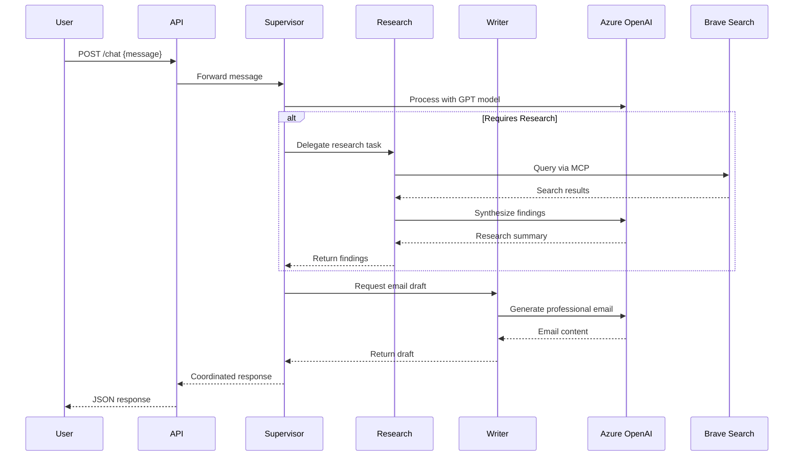

# Microsoft Agent Framework Example Template

A multi-agent AI framework built on Azure AI Foundry that orchestrates email response automation using a supervisor-worker pattern with intelligent delegation.

## Architecture Overview

Multi-agent AI orchestration with a supervisor-worker pattern for intelligent task delegation:

<div align="center">

```
┌─────────────────────────────────────────────────────────────────┐
│                      CLIENT LAYER                               │
│              Postman / Web Clients                              │
└────────────────────────┬────────────────────────────────────────┘
                         │
                         ▼
┌─────────────────────────────────────────────────────────────────┐
│                      API GATEWAY                                │
│                   FastAPI (8000)                                │
│  /chat | /threads | /session | /agents                         │
└────────────────────────┬────────────────────────────────────────┘
                         │
            ┌────────────┼────────────┐
            ▼            ▼            ▼
   ┌──────────────┐ ┌──────────────┐ ┌──────────────┐
   │  SUPERVISOR  │ │  RESEARCH    │ │   WRITER     │
   │    AGENT     │ │    AGENT     │ │    AGENT     │
   │              │ │              │ │              │
   │ • Routing    │ │ • Web Search │ │ • Email      │
   │ • Decision   │ │ • Synthesis  │ │   Drafting   │
   │ • Coord.     │ │              │ │ • Content    │
   └──────┬───────┘ └──────┬───────┘ └──────┬───────┘
          │                │                │
          └────────────────┼────────────────┘
                           ▼
            ┌──────────────────────────────┐
            │   AZURE OpenAI (GPT-4o)      │
            │   Azure AI Foundry Portal    │
            └──────────────┬───────────────┘
                           │
        ┌──────────────────┼──────────────────┐
        ▼                  ▼                  ▼
   ┌─────────┐      ┌──────────────┐   ┌────────────┐
   │  Brave  │      │ Application  │   │   Agents   │
   │ Search  │      │  Insights    │   │ Management │
   └─────────┘      └──────────────┘   └────────────┘
```

[View detailed architecture diagram](images/architecture.svg)

</div>

### Architecture Components

**Client Layer**: Postman or web clients send HTTP requests to the API

**API Gateway**: FastAPI application exposes REST endpoints:
- `/chat` - Chat with supervisor agent
- `/threads` - Manage conversation threads
- `/session` - Manage session state

**Agent Layer**:
- **Supervisor Agent** (Blue) - Orchestrates task routing and delegation
  - Analyzes user messages and decides which agent to delegate to
  - Coordinates multi-step tasks requiring research and writing
  - Returns direct responses for simple queries
- **Research Agent** (Green) - Gathers information from web search
  - Uses Brave Search API for web research
  - Synthesizes findings into clear summaries
- **Writer Agent** (Red) - Generates polished content
  - Drafts professional emails and documents
  - Adapts tone and style to requirements

**External Services**:
- **Azure AI Foundry** - LLM Provider (GPT-4o) for all agents
- **Brave Search API** - Web search for research agent

**Data Layer**:
- Conversation threads stored locally for persistence and history
- Supports session management and multi-turn conversations

## Repository Structure

```mermaid
graph TD
    Root[ms_agent_framework]

    Root --> Src[src/microsoft_agent_framework]
    Root --> Tests[tests/]
    Root --> Config[Configuration Files]
    Root --> Data[data/]
    Root --> Deployment[deployment/]
    Root --> Docs[docs/]

    Src --> Infra[infrastructure/]
    Src --> App[application/]
    Src --> Domain[domain/]

    Infra --> API[api/]
    Infra --> DB[db/]
    Infra --> DI[di/]
    Infra --> LLM[llm_providers/]
    Infra --> MCP[mcp_clients/]
    Infra --> Monitoring[monitoring/]
    Infra --> Repos[repositories/]
    
    API --> MainPy[main.py - FastAPI App]
    API --> Models[models.py - Request/Response Models]

    App --> Agents[agents/]
    App --> Services[services/]
    App --> Factories[factories/]
    App --> Evaluation[evaluation_service/]
    App --> Ingest[ingest_documents_service/]
    App --> Reset[reset_memory_service/]
    
    Agents --> SupervisorPy[supervisor_agent.py]
    Agents --> ResearchPy[research_agent.py]
    Agents --> WriterPy[writer_agent.py]

    Services --> AgentService[agent_service.py]
    Services --> ConvService[conversation_service.py]
    Services --> ConvManager[conversation_manager.py]
    Services --> ConvSession[conversation_session.py]

    Factories --> AgentFactory[agent_factory.py]
    Factories --> AzureAgent[azure_agent.py]

    Domain --> Prompts[prompts/]
    Domain --> Tools[tools/]
    Domain --> Models[models/]
    Domain --> Interfaces[interfaces/]
    Domain --> Exceptions[exceptions.py]
    Domain --> Auth[auth/]
    Domain --> Memory[memory/]

    Prompts --> SupervisorPrompt[supervisor_prompt.py]
    Prompts --> ResearchPrompt[research_prompt.py]
    Prompts --> WriterPrompt[writer_prompt.py]

    Tools --> MCPTools[mcp_tools.py - Brave Search & Gmail]

    Models --> AgentModels[agent_models.py]
    Models --> ConvModels[conversation_models.py]

    Config --> PyProject[pyproject.toml]
    Config --> ConfigPy[config.py]
    Config --> CLIPy[cli.py]
    Config --> Docker[Dockerfile & docker-compose.yaml]
    Config --> Env[.env - Azure OpenAI Config]
```



## Agent Workflow



## Features

- **Multi-Agent Orchestration**: Supervisor agent coordinates specialized worker agents
- **Azure AI Foundry Integration**: Agents are created and managed in Azure AI Foundry portal
  - Agents visible in Azure AI Foundry portal under "Agents" section
  - Full integration with Azure AI Foundry features
  - Cloud-managed agent lifecycle
- **Conversation Management**: Comprehensive conversation and session management
  - Native thread persistence with file-based storage
  - Automatic context retention across messages
  - Session management for seamless CLI and API experience
  - Thread metadata and conversation summaries
- **Advanced Service Architecture**: Layered service design with dependency injection
  - Agent Service for agent lifecycle management
  - Conversation Service for thread persistence
  - Conversation Manager for smart chat coordination
  - Conversation Session for active session tracking
- **Azure AI Foundry Tracing**: Built-in OpenTelemetry tracing for all LLM calls and agent interactions
- **Azure AI Foundry Evaluation**: Cloud-based evaluation with Groundedness and Relevance metrics
- **Factory Pattern**: Extensible agent creation with registry-based factory system
- **MCP Tools Support**: Extensible tool system using Model Context Protocol
  - Brave Search integration for web research
  - Gmail integration for email operations
- **Clean Architecture**: Separated concerns with infrastructure, application, and domain layers
- **REST API**: FastAPI-based API with automatic OpenAPI documentation
- **CLI Interface**: Rich command-line interface with conversation management
- **Docker Support**: Containerized deployment with docker-compose
- **Type Safety**: Full type hints with Pydantic models
- **Enhanced Error Handling**: Comprehensive exception hierarchy with retry mechanisms
- **Configuration Management**: Layered configuration with validation and environment support

## Conversation Management

The framework provides comprehensive conversation and session management capabilities:

### Thread Persistence

Conversations are automatically saved as threads with:
- **Thread ID**: Unique identifier for each conversation
- **Metadata**: Agent type, creation/update timestamps, title, tags
- **Message History**: Complete conversation history with roles and timestamps
- **Context Preservation**: Automatic context retention across sessions

### Session Management

Active sessions are tracked for seamless experience:
- **Current Threads**: Track active conversation for each agent type
- **Session Continuity**: Resume conversations automatically
- **Session Clearing**: Clear specific agent sessions or all sessions

### Smart Chat Features

The conversation manager provides intelligent conversation handling:
- **Auto-Continue**: Automatically continue existing conversations
- **Smart Delegation**: Route messages to appropriate agents
- **Thread Management**: Create, load, save, and delete conversations
- **Session State**: Maintain active conversation state

### File Storage

Conversations are stored in the `conversations/` directory:
- JSON format for easy inspection and backup
- Thread summaries for quick browsing
- Configurable storage location

## Quick Start

### Prerequisites

- Python 3.11 or higher (required by azure-ai-agents framework)
- Azure AI Foundry project (for agent management and visibility)
- Azure CLI installed and authenticated (`az login`)
- [UV](https://github.com/astral-sh/uv) package manager (recommended)

### Installation

1. Clone the repository:
```bash
git clone <repository-url>
cd ms_agent_framework
```

2. Authenticate with Azure:
```bash
az login
```

3. Create and configure your `.env` file:
```bash
cp .env.example .env
```

Edit `.env` with your Azure configuration:
```env
# Azure OpenAI Configuration
AZURE_OPENAI_API_KEY="your-api-key"
AZURE_OPENAI_ENDPOINT="https://your-resource.cognitiveservices.azure.com/"
AZURE_OPENAI_API_VERSION="2025-03-01-preview"
AZURE_OPENAI_RESPONSES_DEPLOYMENT_NAME="your-deployment-name"

# Azure AI Foundry Project (REQUIRED - agents won't appear in portal without this)
PROJECT_ENDPOINT="https://your-resource.services.ai.azure.com/api/projects/your-project"

# Optional: Brave Search API for Research Agent
BRAVE_API_KEY="your-brave-api-key"
```

**Important**: Get your `PROJECT_ENDPOINT` from:
- Azure AI Foundry Portal → Your Project → Settings → Project connection string

4. Install dependencies:
```bash
uv sync --prerelease=allow
```

### Viewing Your Agents in Azure AI Foundry Portal

After running the application, your agents will be automatically created in Azure AI Foundry:

1. Go to [Azure AI Foundry Portal](https://ai.azure.com)
2. Select your project
3. Click on "Agents" in the left navigation
4. You should see three agents:
   - **Supervisor Agent** - Coordinates delegation to other agents
   - **Research Agent** - Performs web searches using Brave Search
   - **Writer Agent** - Creates professional email drafts

The agents are cloud-managed and will persist in the portal for reuse across sessions.

### Running the Application

#### Option 1: Local Development

```bash
uv run fastapi dev src/microsoft_agent_framework/infrastructure/api/main.py
```

The API will be available at:
- API: http://localhost:8000
- Interactive docs: http://localhost:8000/docs

#### Option 2: Docker

```bash
# Build and start
make start-project

# Or manually
docker compose up --build -d

# View logs
docker logs microsoft_agent_framework

# Stop
docker compose stop
```

## CLI Interface

The framework includes a comprehensive command-line interface for easy interaction:

### Basic Commands

```bash
# Get framework information
microsoft_agent_framework info

# List available agent types
microsoft_agent_framework list-agents

# Validate configuration
microsoft_agent_framework validate

# Show current configuration
microsoft_agent_framework config [--show-sensitive]
```

### Chat Commands

```bash
# Simple chat with automatic conversation management
microsoft_agent_framework chat "Help me write an email"

# Chat with specific agent type
microsoft_agent_framework chat "Research quantum computing" --agent-type research

# Start a new conversation (clear previous session)
microsoft_agent_framework chat "New topic" --new

# Chat with custom title
microsoft_agent_framework chat "Project planning" --title "Q4 Planning Session"

# Chat without saving conversation
microsoft_agent_framework chat "Quick question" --no-save
```

### Thread Management

```bash
# List recent conversations
microsoft_agent_framework recent [--agent research] [--limit 10]

# List all conversation threads
microsoft_agent_framework list-threads [--agent-name supervisor] [--limit 20]

# Show thread details
microsoft_agent_framework show-thread <thread-id> [--full]

# Continue specific conversation
microsoft_agent_framework chat "Follow up question" --thread <thread-id>

# Delete a conversation thread
microsoft_agent_framework delete-thread <thread-id> [--yes]
```

### Session Management

```bash
# Show current conversation sessions
microsoft_agent_framework session

# Clear session for specific agent
microsoft_agent_framework clear-session --agent supervisor

# Clear all sessions
microsoft_agent_framework clear-session --all
```

### Development Commands

```bash
# Start the FastAPI server
microsoft_agent_framework serve [--host 0.0.0.0] [--port 8000] [--reload]
```

## API Endpoints

### Chat Endpoint

Send a message to the supervisor agent:

```bash
curl -X POST http://localhost:8000/chat \
  -H "Content-Type: application/json" \
  -d '{"message":"Help me write an email response"}'
```

Response:
```json
{
  "response": {
    "messages": [{
      "role": "assistant",
      "contents": [{
        "text": "Agent response here..."
      }],
      "author_name": "Supervisor Agent"
    }]
  }
}
```

### Other Endpoints

- `GET /` - Welcome message and documentation link
- `GET /health` - Health check with service status
- `POST /eval` - Evaluation endpoint (stub)
- `POST /reset-memory` - Reset agent memory (stub)
- `GET /agents` - List all registered agents
- `POST /chat/smart` - Smart chat with automatic thread management
- `POST /chat/thread` - Chat with explicit thread management
- `POST /threads` - Create a new conversation thread
- `GET /threads` - List conversation threads
- `GET /threads/{thread_id}` - Get specific thread details
- `POST /threads/{thread_id}/chat` - Continue conversation in thread
- `DELETE /threads/{thread_id}` - Delete a conversation thread
- `GET /session` - Get current session information
- `POST /session/clear` - Clear conversation sessions
- `POST /conversation/new` - Start new conversation (clear session)

## Project Structure Details

### Infrastructure Layer (`infrastructure/`)
- **API**: FastAPI application and REST endpoints
- **Models**: Pydantic request/response schemas
- **DB**: Database connection and configuration
- **DI**: Dependency injection container
- **LLM Providers**: Language model provider implementations
- **MCP Clients**: Model Context Protocol client implementations
- **Monitoring**: Observability and monitoring components
- **Repositories**: Data persistence implementations

### Application Layer (`application/`)
- **Agents**: Agent implementations and orchestration logic
  - `supervisor_agent.py`: Main coordinator
  - `research_agent.py`: Web research specialist
  - `writer_agent.py`: Professional email writer
- **Services**: Business logic and coordination services
  - `agent_service.py`: Agent lifecycle management
  - `conversation_service.py`: Thread persistence and management
  - `conversation_manager.py`: Smart conversation coordination
  - `conversation_session.py`: Active session tracking
- **Factories**: Agent creation and configuration
  - `agent_factory.py`: Factory pattern for agent creation
  - `azure_agent.py`: Azure-specific agent implementations
- **Evaluation Service**: Cloud-based evaluation with Azure AI Foundry
- **Ingest Documents Service**: Document processing capabilities
- **Reset Memory Service**: Memory and state management

### Domain Layer (`domain/`)
- **Models**: Core domain entities and value objects
  - `agent_models.py`: Agent-related models
  - `conversation_models.py`: Conversation and thread models
- **Interfaces**: Abstract interfaces and contracts
- **Prompts**: System prompts for each agent
- **Tools**: MCP tool integrations (Brave Search, Gmail)
- **Auth**: Authentication and authorization
- **Memory**: Memory management and persistence
- **Exceptions**: Custom exception hierarchy
- **Utils**: Shared utilities and helpers

## CI/CD Pipeline

This project uses GitHub Actions for automated testing and evaluation:

### Workflows

- **Test Workflow** (`test.yml`)
  - Runs on every push and pull request to `main`/`master`
  - Tests across Python 3.11, 3.12, and 3.13
  - Includes linting with Ruff and unit tests with pytest

- **Evaluation Workflow** (`evaluation.yml`)
  - Runs daily and on pushes to `main`
  - Evaluates multi-agent system on 10 test queries
  - Submits results to Azure AI Foundry cloud evaluation
  - Uses Groundedness and Relevance metrics

### Setup Instructions

For detailed setup instructions including required GitHub secrets, see [GitHub Actions Setup Guide](.github/SETUP_GITHUB_ACTIONS.md).

**Required Secrets:**
- Azure OpenAI credentials (API key, endpoint, deployment name, API version)
- Azure AI Foundry credentials (project endpoint, model deployment name)
- Optional: Application Insights connection string, Brave API key

## Development

### Running Tests

```bash
uv run pytest
```

### Code Quality

The project uses:
- **Ruff**: For linting and formatting
- **Pre-commit hooks**: Automatic code quality checks

Install pre-commit hooks:
```bash
uv run pre-commit install
```

### Architecture Components

#### Service Layer

The application uses a layered service architecture:

1. **Agent Service** (`AgentService`): Manages agent lifecycle and execution
2. **Conversation Service** (`ConversationService`): Handles thread persistence and retrieval
3. **Conversation Manager** (`ConversationManager`): Coordinates smart conversation features
4. **Conversation Session** (`ConversationSession`): Tracks active sessions

#### Factory Pattern

Agent creation uses the factory pattern:

```python
from microsoft_agent_framework.application.factories import agent_factory
from microsoft_agent_framework.domain.models import AgentConfig, AgentType

# Create agent configuration
config = AgentConfig(
    name="my_agent",
    agent_type=AgentType.SUPERVISOR,
    instructions="Custom instructions"
)

# Create agent using factory
agent = agent_factory.create_agent("supervisor", config)
```

#### Dependency Injection

Services are managed through dependency injection in the API layer:

```python
async def get_agent_service() -> AgentService:
    """Dependency injection for agent service."""
    # Service initialization and registration
```

### Adding New Agents

1. Create agent file in `src/microsoft_agent_framework/application/agents/`
2. Define prompt in `src/microsoft_agent_framework/domain/prompts/`
3. Add agent type to `AgentType` enum in domain models
4. Register in `AzureAgentFactory.create_agent()` method
5. Update supervisor orchestration logic if needed

### Adding New Services

1. Create service interface in `src/microsoft_agent_framework/domain/interfaces/`
2. Implement service in `src/microsoft_agent_framework/application/services/`
3. Add dependency injection in API layer
4. Register in DI container if needed

### Adding MCP Tools

1. Add tool configuration in `src/microsoft_agent_framework/domain/tools/mcp_tools.py`
2. Update `AzureAgentFactory._create_tools()` method
3. Pass tool to agent in application layer
4. Update agent instructions to use the tool

## Configuration

The framework uses a layered configuration system with Pydantic settings and validation.

### Environment Variables

#### Azure AI Foundry (REQUIRED)

| Variable | Description | Required |
|----------|-------------|----------|
| `PROJECT_ENDPOINT` | Azure AI Foundry project endpoint | Yes |
| `AZURE_SUBSCRIPTION_ID` | Azure subscription ID | No |
| `AZURE_RESOURCE_GROUP` | Azure resource group name | No |
| `AZURE_PROJECT_NAME` | Azure project name | No |

**Authentication**: The application uses Azure DefaultAzureCredential for authentication:
- Run `az login` before starting the application
- The credential chain will try: Azure CLI → Managed Identity → Environment variables
- For production deployments, use Managed Identity

#### Azure OpenAI

| Variable | Description | Required | Default |
|----------|-------------|----------|---------|
| `AZURE_OPENAI_API_KEY` | Azure OpenAI API key | Yes | None |
| `AZURE_OPENAI_ENDPOINT` | Azure OpenAI endpoint URL | Yes | None |
| `AZURE_OPENAI_API_VERSION` | API version (must be 2025-03-01-preview or later) | Yes | `2024-02-01` |
| `AZURE_OPENAI_RESPONSES_DEPLOYMENT_NAME` | Deployment name for your model | Yes | None |

#### Application Configuration

| Variable | Description | Required | Default |
|----------|-------------|----------|---------|
| `ENVIRONMENT` | Application environment (development/staging/production/testing) | No | `development` |
| `DEBUG` | Enable debug mode | No | `true` |
| `API_HOST` | API host address | No | `0.0.0.0` |
| `API_PORT` | API port number | No | `8000` |
| `API_WORKERS` | Number of API workers | No | `1` |
| `LOG_LEVEL` | Logging level | No | `INFO` |
| `LOG_FILE` | Log file path | No | None |
| `DEFAULT_MAX_TOKENS` | Default max tokens for agents | No | `4000` |
| `DEFAULT_TEMPERATURE` | Default temperature for agents | No | `0.7` |
| `AGENT_TIMEOUT` | Agent execution timeout in seconds | No | `300` |

#### Observability & Tracing

| Variable | Description | Required | Default |
|----------|-------------|----------|---------|
| `ENABLE_OTEL` | Enable OpenTelemetry tracing for all LLM calls | No | `true` |
| `ENABLE_SENSITIVE_DATA` | Include prompts/responses in traces (use `false` in production) | No | `false` |
| `APPLICATIONINSIGHTS_CONNECTION_STRING` | Azure Application Insights connection string for Azure AI Foundry | No | None |
| `OTLP_ENDPOINT` | Custom OTLP endpoint (e.g., http://localhost:4317) | No | None |

#### Tools & External Services

| Variable | Description | Required | Default |
|----------|-------------|----------|---------|
| `BRAVE_API_KEY` | Brave Search API key for research agent | No | None |

#### Resilience & Error Handling

| Variable | Description | Required | Default |
|----------|-------------|----------|---------|
| `RESILIENCE_ENABLE_RETRIES` | Enable retry logic globally | No | `true` |
| `RESILIENCE_DEFAULT_MAX_ATTEMPTS` | Default maximum retry attempts | No | `3` |
| `RESILIENCE_DEFAULT_BASE_DELAY` | Default base delay between retries | No | `1.0` |
| `RESILIENCE_DEFAULT_MAX_DELAY` | Default maximum delay between retries | No | `60.0` |
| `RESILIENCE_AGENT_EXECUTION_TIMEOUT` | Agent execution timeout in seconds | No | `300.0` |
| `RESILIENCE_CONNECTION_TIMEOUT` | Default connection timeout in seconds | No | `30.0` |

### Python Requirements

- Python >= 3.11 (required by azure-ai-agents)
- All dependencies managed via `pyproject.toml` and `uv.lock`

## Troubleshooting

### API Version Error

If you see: `Azure OpenAI Responses API is enabled only for api-version 2025-03-01-preview and later`

Solution: Update your `.env` file:
```env
AZURE_OPENAI_API_VERSION="2025-03-01-preview"
```

### Import Errors

If agents fail to import, ensure you've installed with prerelease flag:
```bash
uv sync --prerelease=allow
```

### Docker Build Issues

Clear cache and rebuild:
```bash
docker compose down -v
docker compose up --build
```

## Azure AI Foundry Integration

### Tracing

This framework automatically traces all LLM calls and agent interactions using OpenTelemetry, enabling deep observability in Azure AI Foundry.

#### Setup Azure AI Foundry Tracing

1. **Get your Application Insights connection string** from Azure Portal:
   - Navigate to your Azure AI Foundry project
   - Go to Application Insights resource
   - Copy the connection string from Properties

2. **Add to your `.env` file**:
```env
APPLICATIONINSIGHTS_CONNECTION_STRING="InstrumentationKey=your-key;IngestionEndpoint=https://your-region.in.applicationinsights.azure.com/"
```

3. **View traces** in Azure AI Foundry Portal:
   - Open your AI Foundry project
   - Navigate to "Tracing" or "Observability" section
   - View agent interactions, LLM calls, tool usage, and performance metrics

#### Trace Data Captured

- **Agent Execution**: Start/end times, input/output for each agent
- **LLM Calls**: Model, tokens used, latency, prompts (if enabled)
- **Tool Invocations**: MCP tool calls (Brave Search, Gmail)
- **Performance Metrics**: Response times, token usage, error rates

#### Development Tracing

For local development, you can use an OTLP endpoint:

```env
ENABLE_OTEL=true
OTLP_ENDPOINT=http://localhost:4317
```

Run with Aspire Dashboard or OpenTelemetry Collector to view traces locally.

### Cloud Evaluation

Evaluate your multi-agent system using Azure AI Foundry cloud evaluation with built-in evaluators for Groundedness and Relevance.

#### Setup Cloud Evaluation

1. **Configure Azure AI Foundry project** in your `.env` file:
```env
# Azure AI Foundry Project Configuration (for cloud evaluation)
PROJECT_ENDPOINT="https://your-resource.services.ai.azure.com/api/projects/your-project"
AZURE_SUBSCRIPTION_ID="your-subscription-id"
RESOURCE_GROUP_NAME="your-resource-group"
PROJECT_NAME="your-project-name"

# Brave Search API (required for research agent)
BRAVE_API_KEY="your-brave-api-key"
```

2. **Authenticate with Azure CLI**:
```bash
az login
```

3. **Run evaluation**:
```bash
# Generate responses and evaluate
PYTHONPATH=src uv run python src/microsoft_agent_framework/application/evaluation_service/eval.py

# Or skip generation and use existing responses
# Edit eval.py and set skip_generation=True
```

#### What Gets Evaluated

The evaluation system:
- Loads test queries from `data/qr_data.jsonl`
- Calls the actual multi-agent system (supervisor + research + writer)
- Evaluates responses using cloud evaluators:
  - **Groundedness**: Measures if response is grounded in context
  - **Relevance**: Measures how relevant response is to query
- Uploads results to Azure AI Foundry portal

#### View Evaluation Results

After running evaluation, check your Azure AI Foundry portal:
1. Navigate to your AI Foundry project
2. Go to "Evaluation" tab
3. View metrics, scores, and detailed results

#### Evaluation Data Format

Create test data in JSONL format (`data/qr_data.jsonl`):
```jsonl
{"query": "Write a thank you email to Sarah", "response": "Expected response..."}
{"query": "Research quantum computing trends", "response": "Expected response..."}
```
## Authors
Michael Liav
Roey Zalta

## License

MIT
